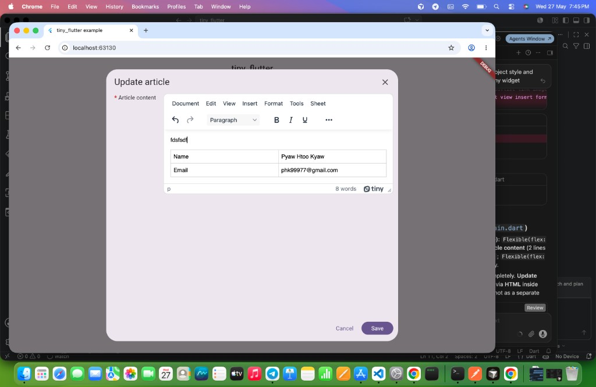

# tiny_flutter

A Flutter package that embeds [**TinyMCE**](https://www.tiny.cloud/) — a browser-based **HTML rich text editor** — in your app on **Flutter web** using `HtmlElementView`. The package ships the editor shell as an asset; your app composes labels, dialogs, and layout around [`TinyMceEditor`](lib/src/tiny_mce_editor_web.dart).

> **Disclaimer:** `tiny_flutter` is an independent community package and is **not** affiliated with, endorsed by, or maintained by [Tiny Technologies](https://www.tiny.cloud/) (TinyMCE).

## Features

✅ **Web** — Rich text editing via TinyMCE inside Flutter web.  
✅ **Lightweight API** — One editor widget plus `getEditorContent` / `setEditorContent`.  
✅ **No extra runtime deps** — Only `flutter` SDK; TinyMCE loads from CDN in the bundled HTML.

## Getting started

Add `tiny_flutter` to your `pubspec.yaml`:

```yaml
dependencies:
  tiny_flutter:
    git:
      url: https://github.com/pyaehtookyaw/tiny_flutter.git
```

Import the library:

```dart
import 'package:tiny_flutter/tiny_flutter.dart';
```

## Demo



## Screenshots (Web)

|  |  |
| :--: | :--: |
| Create article (empty editor) | Update article (demo HTML in editor) |

## Example usage

Place [`TinyMceEditor`](lib/src/tiny_mce_editor_web.dart) where you need the editor (often inside a dialog or a `Row` with your own “Article content” label):

```dart
import 'package:flutter/material.dart';
import 'package:tiny_flutter/tiny_flutter.dart';

class ArticleBody extends StatelessWidget {
  const ArticleBody({super.key});

  @override
  Widget build(BuildContext context) {
    return Row(
      crossAxisAlignment: CrossAxisAlignment.start,
      children: [
        Flexible(
          flex: 1,
          child: Row(
            children: [
              Text('* ', style: TextStyle(color: Colors.red.shade700)),
              const Expanded(
                child: Text(
                  'Article content',
                  maxLines: 2,
                  overflow: TextOverflow.ellipsis,
                ),
              ),
            ],
          ),
        ),
        const SizedBox(width: 8),
        const Flexible(
          flex: 5,
          child: TinyMceEditor(heightFactor: 0.35),
        ),
      ],
    );
  }
}

Future<void> readAndSave() async {
  final html = await TinyMceEditor.getEditorContent();
  TinyMceEditor.setEditorContent('<p>Hello</p>');
  // use html (e.g. send to API)
}
```

A full flow (home buttons, white dialogs, create vs update) lives in the [`example`](example/lib/main.dart) app — run from the `example/` folder on web.
